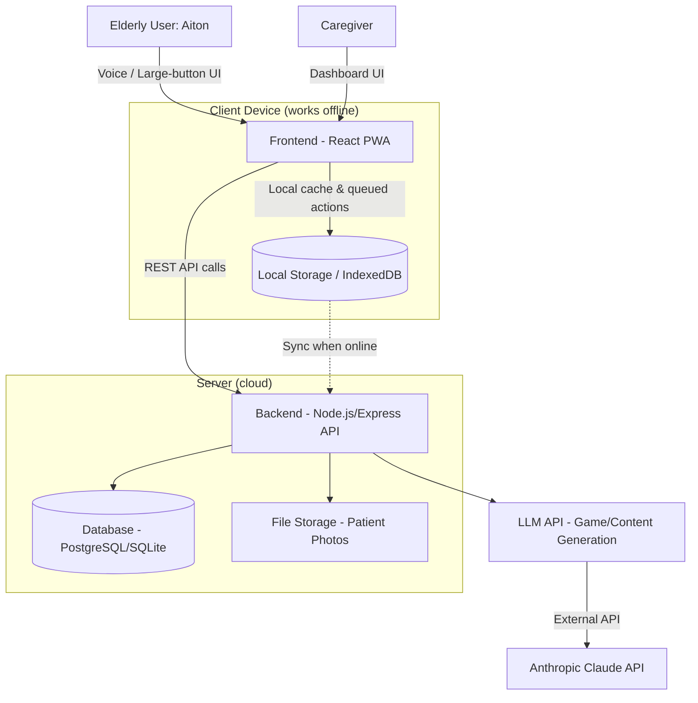
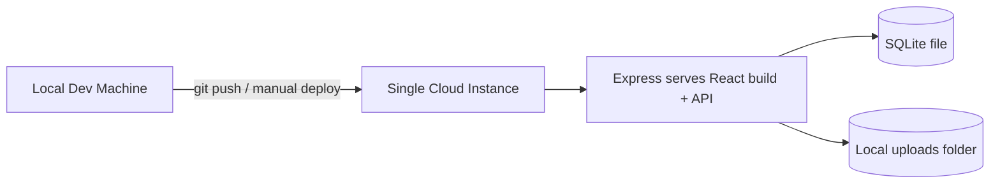

# Architecture — AI Cognitive Companion for Elderly Dementia Patients (NER)

> Status: Hackathon MVP foundation document. Source of truth for system design.

## 1. System Overview

In simple terms: this is a web app that turns an elderly dementia patient's own life — their family photos, names, routines, and regional/cultural context — into simple memory games. The patient (demo user: **Aiton**) plays these games through a large-button, voice-friendly interface. A caregiver can view a separate dashboard showing how Aiton is doing (engagement, scores, trends) and manage reminders.

For the hackathon, we build this as a single web application (not native mobile) that works in the browser, is installable/offline-capable via a Progressive Web App (PWA) approach, and uses a lightweight backend + database + an LLM API for personalization and content generation.

We are explicitly **not** building a distributed, multi-service, enterprise system. One frontend, one backend, one database, one AI provider.

## 2. Architecture Diagram



## 3. Technology Stack

| Layer | Choice | Why |
|---|---|---|
| Frontend | **React (Vite) + PWA** | Fast to build, huge ecosystem, PWA plugin gives offline support with minimal extra work. Vite gives instant dev feedback for hackathon speed. |
| UI Styling | **Tailwind CSS** | Rapid styling without writing custom CSS files; easy to enforce a consistent design system (large fonts, big buttons) needed for elderly users. |
| Backend | **Node.js + Express** | Same language (JS/TS) as frontend reduces context-switching for a small hackathon team. Minimal boilerplate, huge community, fast to stand up REST endpoints. |
| Database | **SQLite (file-based)** for demo, structured so it can move to **PostgreSQL** later. **Implemented via Node's built-in `node:sqlite`** (not Prisma/Knex, not `better-sqlite3`) | SQLite needs zero setup/hosting — perfect for a hackathon demo with one user. Schema will be simple relational tables, portable to Postgres if the project continues. `better-sqlite3`'s native binding segfaulted in this dev environment; `node:sqlite` is a dependency-free built-in that works reliably and still gives synchronous SQL access to a real SQLite file. No ORM/query-builder layer was added on top since the schema is currently one table (`users`) — revisit if the schema grows. |
| Authentication | **Seeded users + JWT**, implemented: `POST /api/auth/login` checks username/password (bcrypt) against seeded `users` rows for both demo accounts ("aiton" patient, "caregiver"/"Ban"), returns a JWT the frontend stores in `localStorage` and decodes client-side for role-based routing | We only need two demo users (one per role). No OAuth, no MFA, no email verification — those add complexity with zero demo value. JWT (vs. server session) needs no session store, keeping the backend stateless and simple. |
| AI/LLM | **Anthropic Claude API (Claude Sonnet)** | Used to: (1) generate personalized quiz/game questions from patient memory data (names, photos, routines, regional facts), (2) adapt difficulty/phrasing, (3) summarize caregiver-facing insights in plain language. Claude is chosen since this environment is Claude Code / Anthropic-native and has strong instruction-following for structured JSON game generation. |
| Voice | **Browser Web Speech API** (SpeechRecognition + SpeechSynthesis) | Built into modern browsers, zero extra cost/infra, good enough for MVP voice input/output. Avoids needing a paid speech vendor for the hackathon. |
| File Storage | **Local server filesystem** (uploads folder) for patient photos — **implemented**: `backend/uploads/memories/`, served via `express.static`, using `multer` for upload handling | No need for S3/cloud storage infra for one demo user; simplest possible approach. Structured so it could swap to S3-compatible storage later — only `middleware/upload.js` would need to change, since routes only ever deal in the stored relative path, not file bytes. |
| Offline Support | **Service Worker (PWA) + IndexedDB** caching games/reminders, background sync on reconnect | Directly required by the problem statement (low-connectivity NER areas). Native browser APIs — no extra backend service needed. |
| Deployment | **Single deployable app**: Frontend built as static assets, served by the same Express backend (or Vercel/Render single-instance deploy) | One deployable unit is easiest to demo reliably. Avoids managing multiple environments/services under time pressure. |

## 4. Authentication

**Requirement:** one demo user, "Aiton," must be able to log in simply. A caregiver view also exists but for MVP can share the same simple login gate (a "role" flag on the session, not a separate auth system).

**Approach (implemented):**
- One seeded user row in the database: `username: aiton`, `password_hash: <bcrypt>`, `role: patient`, `display_name: Aiton`.
- One seeded caregiver user: `username: caregiver`, `role: caregiver`, `display_name: Ban`.
- Login endpoint: `POST /api/auth/login` — checks credentials, returns a signed JWT (12h expiry).
- Frontend stores the token in `localStorage` and attaches it as `Authorization: Bearer <token>` on API calls. The same underlying session (`AuthContext`) is gated two different ways depending on role, both intentional given who's using each surface:
  - **Caregiver** (`/caregiver`): a `ProtectedRoute` component redirects to `/login?redirect=/caregiver` when unauthenticated, preserving the destination through login. Standard, expected behavior for a digitally-literate user.
  - **Patient** (`/patient`): no redirect at all. The route always renders the patient interface; an in-page login modal overlays it when unauthenticated, dimming/disabling (not hiding) the interface behind it. This exists specifically so an elderly user is never bounced to an unfamiliar screen just to authenticate — see design.md's Modal entry and requirements around the Patient Interface.
- No password reset, no email verification, no OAuth, no MFA, no roles/permissions system beyond a single `role` string used to route to the right UI (patient view vs caregiver view).
- Designed so a real multi-user auth system (e.g., proper user table + registration) could be added later without restructuring — the `users` table already has `id`, `username`, `password_hash`, `role`, `display_name`.

## 5. Core Data Flow

1. Caregiver (or seed script) inputs Aiton's personal data: family member names/relationships, photos, daily routine items, and regional/cultural facts (NER-specific).
2. This data is stored in the database. **Implementation note:** rather than a separate `patients` table as originally sketched here, `family_members` and `memories` (both implemented) reference the existing `users` table directly (`patient_id` → `users.id` where `role='patient'`) — there was already a patient concept via `role`, so a second one wasn't created. `routines` doesn't exist yet.
3. When Aiton opens a game, the frontend requests a game session from the backend.
4. Backend fetches relevant patient memory data, sends it (with a prompt template) to the Claude API to generate a personalized game (e.g., "Who is this person in the photo?", "What time do you usually have tea?").
5. Backend returns structured game JSON to frontend; frontend renders it as a simple, voice-enabled UI.
6. Aiton answers the game (via tap or voice); frontend records the result locally (IndexedDB) immediately, and syncs to backend when online.
7. Backend stores results in `game_sessions`/`game_results` tables.
8. Caregiver dashboard queries aggregated results to show trends, engagement, and alerts (e.g., "no activity in 3 days").

## 6. AI Flow

**AI IS required** for personalized game generation and caregiver insight summaries.

```
User/Caregiver-entered memory data (names, photos, routines, region)
        → Backend builds a structured prompt with this context
        → Claude API generates a game (JSON: question, options, correct answer, difficulty)
        → Backend validates/sanitizes JSON
        → Frontend renders the game to Aiton
        → Aiton's answer + response time recorded
        → (Later) Backend sends aggregated performance data to Claude
        → Claude returns a plain-language caregiver summary ("Aiton's memory recall was strong this week but reaction time slowed on afternoon sessions")
        → Displayed on caregiver dashboard
```

Difficulty adaptation for MVP: **simple rule-based logic** in the backend (e.g., if last 3 answers correct → increase difficulty tier; if 2 wrong → decrease), NOT a separate ML model. This keeps it reliable and explainable for a demo. AI is used for *content generation and summarization*, not for real-time adaptive scoring — that logic is deterministic and testable.

Voice input/output uses the **browser's native Web Speech API** — no AI model call needed for that; it's not an AI flow, it's a browser API.

## 7. Security (MVP-practical only)

- Passwords hashed with bcrypt (never stored plain text).
- JWT/session tokens with reasonable expiry.
- API routes require valid auth token except `/api/login`.
- Basic input validation on all endpoints (avoid SQL injection via parameterized queries/ORM).
- File uploads (photos) restricted by file type/size.
- No sensitive data (like precise health diagnoses) exposed in client-side logs.
- HTTPS assumed at deployment platform level (e.g., Vercel/Render provide this by default).
- No need for: rate limiting infra, WAF, pen-testing, GDPR tooling, audit logs — out of scope for hackathon MVP.

## 8. Deployment

Simplest possible setup for demo reliability:

- **Frontend + Backend**: bundled together — Express serves the built React static files AND the API, deployed as a single service (e.g., Render, Railway, or a single VM/Replit).
- **Database**: SQLite file co-located with the backend (single instance, no separate DB server to manage). If time permits, swap to a managed Postgres (e.g., Supabase/Neon free tier) — architecture supports this without code changes beyond the connection string, since we'll use a lightweight query builder (e.g., Prisma or Knex) rather than raw SQLite-specific calls.
- **File storage**: local disk on the same server instance (acceptable for single-demo-user MVP).
- No CI/CD pipeline required — manual deploy is fine for hackathon timelines. A simple `npm run build && npm start` deploy script is sufficient.



## 9. Architecture Principles

- **Keep it simple** — one frontend, one backend, one database. No microservices.
- **Minimize dependencies** — pick well-known, boring, reliable libraries (Express, React, Prisma/Knex) over niche ones.
- **Avoid premature abstraction** — don't build a plugin system, multi-tenant support, or generic "game engine" until we actually need more than one or two game types.
- **Build for demo reliability** — prefer deterministic logic (rule-based difficulty) over fragile AI-only logic where correctness matters for the live demo.
- **Prefer maintainability** — structure code so a second demo user or a real auth system could be added later without a rewrite, even though we only build for one user now.
- **Don't build features that aren't required** — no admin panels, no multi-language content pipeline beyond what's demoed, no analytics infra beyond what caregiver dashboard needs.
